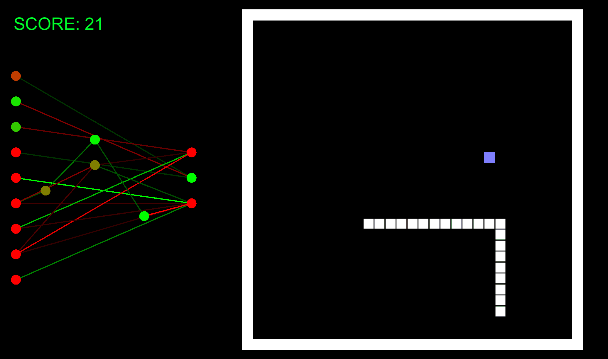

# NEAT_CSharp
Implementation of Neuroevolution of Augmenting Topologies (NEAT) in C#

The algorithm is based on Ken Stanley's paper: http://nn.cs.utexas.edu/downloads/papers/stanley.alife03.pdf
and resources on his website: http://www.cs.ucf.edu/~kstanley/neat.html

In short NEATs is a way to find the neural network solving the problem from the population of networks. Topology of those networks is
changing over time (unlike in traditional neural networks), with nodes and connections being added and removed besides weight changes.

Below is a sample (not yet included) of a NEATs used to train snake (initially it didn't knew what do to at all):

